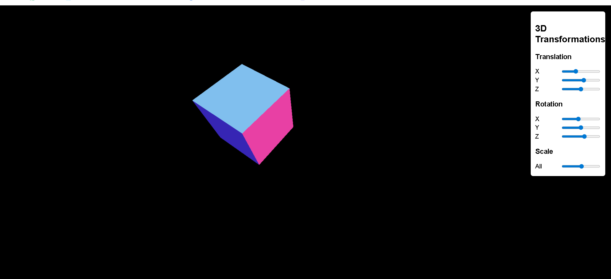

# Lab 2 - 3D Transformations using Three.js

## 📌 Aim
To develop an interactive 3D application to visualize transformations such as Translation, Rotation, and Scaling using Three.js.

## ⚙️ Technologies Used
- HTML
- CSS
- JavaScript
- Three.js (via CDN)

## 🧠 Concepts Covered
- 3D Scene Creation
- Camera and Renderer setup
- Translation (Position)
- Rotation (X, Y, Z axes)
- Scaling (Uniform scaling)

## ▶️ How to Run
1. Open the project in VS Code
2. Right-click on `index.html`
3. Select **Open with Live Server**

## 🎮 Features
- Move cube using X, Y, Z sliders
- Rotate cube across all axes
- Resize cube using scaling slider
- Real-time interactive changes

## 📸 Output

## ✅ Result
A 3D cube was successfully created and transformations such as translation, rotation, and scaling were applied interactively using sliders.